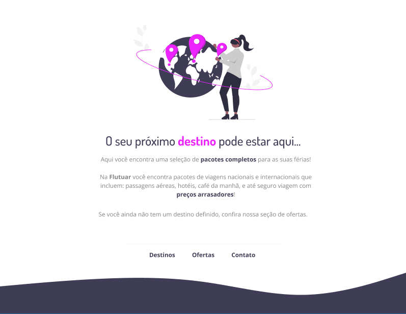

<h1 align="center"> Agência de viagens - Flutuar </h1>

  <a href="#-tecnologias">Tecnologias</a>&nbsp;&nbsp;&nbsp;|&nbsp;&nbsp;&nbsp;
  <a href="#-projeto">Projeto</a>&nbsp;&nbsp;&nbsp;|&nbsp;&nbsp;&nbsp;
  <a href="#-layout">Layout</a>&nbsp;&nbsp;&nbsp;
 

  

## 🚀 Tecnologias

Esse projeto foi desenvolvido com as seguintes tecnologias:

- HTML e CSS
- Git e Github
- Figma

## 💻 Projeto

Este é um projeto de desenvolvimento web criado como parte do curso da Rocketseat. A página representa uma agência de viagens chamada "Flutuar", e foi construída usando tecnologias HTML e CSS.

## 🔖 Layout

Você pode visualizar o layout do projeto através [DESSE LINK](https://www.figma.com/file/03JdgvCSBcf1MlrDhxdZTC/Projeto01-Extra-Copy?fuid=1301745258112043399). É necessário ter conta no [Figma](https://figma.com) para acessá-lo.

